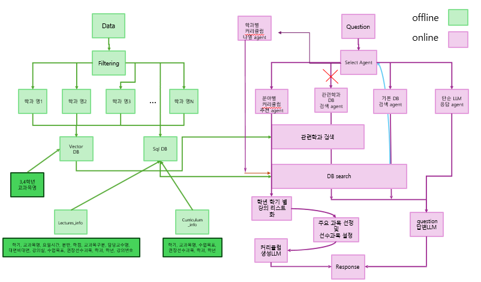
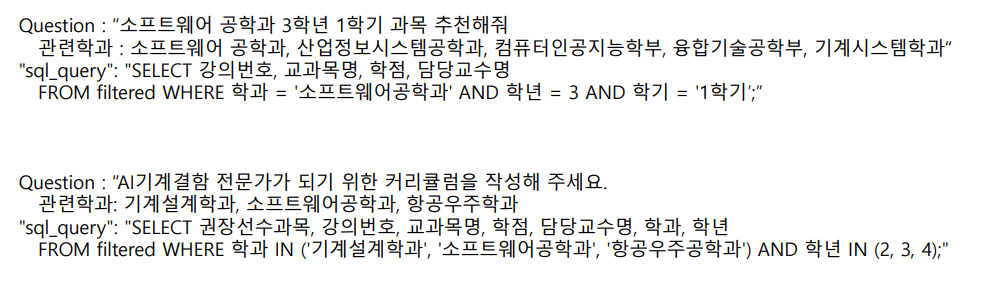
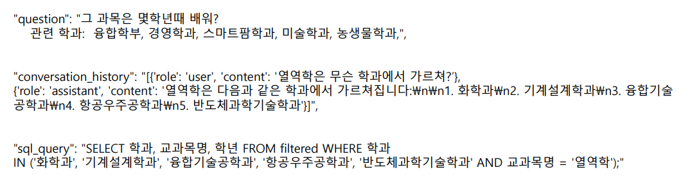

# 🎓 AI Mentor

AI Mentor는 **거대 언어모델(LLM)**을 활용하여 학생들이 개설된 교과 정보를 기반으로 **개별 맞춤형 전공 설계 및 질의응답이 가능한 시스템**입니다.

- 학생들과 **질의응답을 수행하는 시스템** 구축
- **맞춤형 전공 설계 정보를 제공하는 시스템** 구축

---

## 📌 Table of Contents

1. [👥 팀원 소개](#-팀원-소개)
2. [📊 응답 생성 과정](#-응답-생성-과정)
3. [📂 데이터와 필터링](#-데이터와-필터링)
4. [🤖 에이전트 기반 질의응답 시스템](#-에이전트-기반-질의응답-시스템)
5. [💾 SQL Query 생성 방법](#-sql-query-생성-방법)
6. [🧠 분야별 커리큘럼 생성](#-분야별-커리큘럼-생성)
7. [📖 학과별 커리큘럼 조회](#-학과별-커리큘럼-조회)

---

## 👥 팀원 소개

| 이름   | 역할   | 담당 내용 |
|--------|--------|----------------------------------|
| 조성진 | 팀원   | 데이터 전처리, 벡터 DB, 에이전트 개발 |
| 김현호 | 팀원   | 프론트엔드 구현 및 SQL DB 구축 |

---

## 📊 응답 생성 과정

  

---

## 📂 데이터와 필터링

### 📌 사용된 데이터
- **2023년 2학기 강의계획서**
- **2024년 1학기 강의계획서**

### 🛠 데이터 필터링 과정
- **전공 과목만 남기고 불필요한 교과목 제거**
- **불필요한 칼럼 삭제 및 데이터 정리**
- **‘학과학년’ 칼럼을 ‘학과’와 ‘학년’으로 분리**
- **불완전한 학과명을 정리** (예: ‘화학’ → ‘화학과’)
- **정수 및 실수 데이터를 문자열로 변환 (LLM 인식 최적화)**
- **과거/현재 학과명을 비교하여 변경된 학과를 하나로 통일**
  - 두 학과의 **Jaccard 유사도 ≥ 0.3**이면 병합
  - 예: `화학공학부 = 화공부`, `미디어커뮤니케이션학과 = 신문방송학과`

### 💾 데이터 저장 구조
- **SQL DB 구축**
  - `Lectures Info DB` → 강의 검색에 활용
  - `Curriculum Info DB` → 중복 교과목을 통합하여 커리큘럼 생성
- **Vector DB 구축 (학과 임베딩)**
  - 학과별 목표 및 소개글을 JSON 형식으로 저장 후 **임베딩**
  - **intfloat/multilingual-e5-large 모델 사용**
  - **코사인 유사도 기반 검색** (LLM보다 속도 빠르고 비용 절감)

---

## 🤖 에이전트 기반 질의응답 시스템

각기 다른 유형의 질문을 효과적으로 처리하기 위해 **전용 에이전트**를 배정합니다.

### 🏗 에이전트 종류
| 번호 | 에이전트 종류 | 예시 질문 |
|------|-------------|--------------------------------------|
| 1️⃣  | 단순 검색 에이전트 | "자료구조는 누가 가르쳐?" |
| 2️⃣  | 관련 학과 검색 에이전트 | "컴퓨터공학과 2학년 1학기에 뭘 배워?" |
| 3️⃣  | 단순 LLM 질의응답 | "오늘 점심 뭐 먹지?" |
| 4️⃣  | 분야별 커리큘럼 생성 | "메디컬 AI 전문가가 되려면 어떤 과목을 들어야 해?" |
| 5️⃣  | 학과 커리큘럼 조회 | "통계학과 커리큘럼 알려줘." |
| 6️⃣  | 유사 학과 커리큘럼 조회 | "컴퓨터공학과 커리큘럼을 알려줘." |

---

## 💾 SQL Query 생성 방법

질문 유형에 맞춰 **Few-shot Prompting**을 활용하여 SQL Query를 생성합니다.

  

### 📌 History 반영 여부에 따른 차이
| ✅ History 미반영 | ✅ History 반영 |
|------------------|------------------|
| 

 | 

 |

- 기본적으로 SQL DB에서 검색된 데이터를 활용하여 응답을 생성
- **검색 결과가 없을 경우**, 관련 학과를 탐색하여 재검색 후 응답 생성

---

## 🧠 분야별 커리큘럼 생성

질문을 분석하여 **맞춤형 커리큘럼을 생성**합니다.

### 📌 커리큘럼 생성 과정
1️⃣ **분야 정의**: 해당 분야가 무엇인지 설명  
2️⃣ **필요 기술 파악**: 해당 분야에서 필요한 역량 분석  
3️⃣ **관련 학과 탐색**: 학과별 데이터를 검색 후 학과 추천  
4️⃣ **커리큘럼 생성**: **4학년 2학기부터 2학년 1학기까지** 역순으로 추천  
   - 역순 추천 이유: **선수 과목 추천을 위해**  
   - 예: AI 모델링을 추천하려면 **선수 과목으로 선형대수학 포함**

---

## 📖 학과별 커리큘럼 조회

- 특정 학과의 **전체 커리큘럼을 조회**하는 기능
- **4학년 2학기 → 2학년 1학기** 역순으로 강의 나열
- 관련 학과 검색 후 커리큘럼을 보여줌 (유사 학과 포함)

