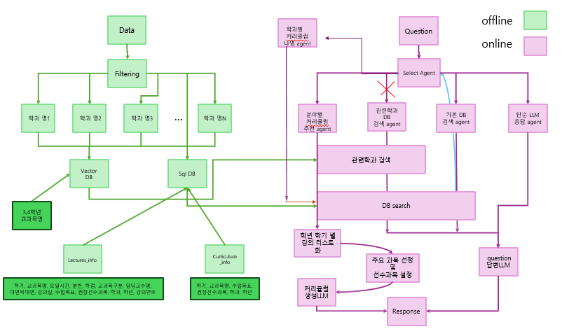

## AI mentor란? 
**거대 언어모델**을 활용한 개설 교과 정보를 활용하여 학생들과 질의응답을 수행할 수 있는 개별 맞춤형 전공 설계 정보 제공하는 시스템
- 학생들과 질의응답을 수행할 수 있는 시스템 구축
- 개별 맞춤형 전공 설계 정보 제공하는 시스템 구축
  
**응답 생성 과정 도식화**

  

---

### 데이터와 필터링
- **데이터**: 2023년 2학기 강의계획서와 2024년 1학기 강의계획서
- **필터링**:
  - 교과목구분이 전공과목인 강의만 남기고 모두 제거
  - 상대적으로 불필요한 정보(칼럼)를 제거하고 저장하도록 함
  - '학과학년' 칼럼을 '학과', '학년'으로 구분지어 저장함 (다수의 학과가 작성되어 있는 교과목도 구분)

    (e.g. ’물리학과 3’ → ‘물리학과‘ ,’3’   ‘경영학과 3, 회계학과 3’ → ‘경영학과, 회계학과‘, ‘3, 3’)
  -  학과명이 불완전 혹은 불필요하게 작성되어 있는 부분을 정리함
    - 괄호 안의 내용은 통일성을 위해 삭제함
    - '학'으로 끝나는 학과명에 '과'를 추가함 (e.g. 화학 → 화학과)
    - '학', '과', '부'로 끝나지 않는 학과명에 '학과'를 추가함 (e.g. 경영 → 경영학과)
  - 정수, 실수형 데이터는 llm이 잘 인식할 수 있도록 문자열 형태로 변환함
  - 과거와 현재를 비교하여 학과명이 변경되거나 합쳐진 학과를 찾아 하나의 학과명으로 통일함
      - 두 학과의 교과목명의 Jaccard 유사도가 0.3 이상인 학과
      - 두 학과의 교과목명의 교집합이 하나의 학과의 교과목명 집합과 같은 경우 (하나의 학과 교과목명 집합이 다른 학과 교과목명 집합에 속한 경우)
        
        e.g. 화학공학부 <- 병합된 학과들: 화공부, 미디어커뮤니케이션학과 <- 병합된 학과들: 신문방송학과

  - 모든 필터링 이후 SQL DB를 생성함
    - **Lectures info DB**: 모든 강의들에 대한 필요한 정보를 저장하여 검색 기능에 쓰임
    - **Curriculum info DB**: 같은 학과 내에 중복 교과목을 하나로 통일하여 커리큘럼 생성에 혼란을 방지
  - 직업이나 분야에 관한 질문이 들어왔을 때 해당 질문에 유사한 학과를 검색하기 위해 학과별로 정보를 저장해놓은 Vector DB 생성
    - 각 학과별로 학과목표 및 소개글을 json형식으로 정리한 후 이를 임베딩을 진행시켜 저장
    - 임베딩 모델은 intfloat/multilingual-e5-large 사용
        - instruction tuning을 거친 모델이기 때문에 의도를 더 잘 파악하고 특정 질문이나 요청에 맞는 의미적인 임베딩을 생성하기 위해 해당 모델을 사용
    - 임베딩된 값은 코사인 유사도 측정을 위해 정규화가 진행되어 Vector DB에 저장됨

---

### 질문 별 에이전트의 기능
하나의 LLM이 다양한 장르의 질문을 처리하는 데에 한계가 있다고 판단하여 각 장르 별로 적절한 에이전트를 배정

#### 에이전트의 종류는 다음과 같음:
**1. 단순 검색 처리 에이전트** (e.g. 자료구조는 누가 가르쳐?)

**2. 관련학과 검색 처리 에이전트** (e.g. 컴퓨터공학과에선 2학년 1학기에 뭘 배워?)
  - 현재 컴퓨터인공지능학부로 데이터가 저장되어있어 이러한 경우 1번 에이전트로 가게되면 검색 결과가 없으므로 이러한 질문은 2번으로 재배정되어 질문과 관련된 학과를 검색 후 이를 기반으로 재검색 후 응답을 생성함

**3. 단순 LLM** (e.g. 오늘 점심 뭐먹지?)

**4. 분야 관련 커리큘럼 생성 에이전트** (e.g. 메디털 AI 전문가가 되기 위해 어떤 과목을 들을까?)

**5. 학과 관련 커리큘럼 생성 에이전트** (e.g. 통계학과 커리큘럼을 알려줘.)

**6. 학과 관련 커리큘럼 생성 에이전트** (e.g. 컴퓨터공학과 커리큘럼을 알려줘.)
  - 2번과 같은 이유로 관련된 학과를 검색 후 이를 기반으로 재검색 후 응답을 생성하도록 함

